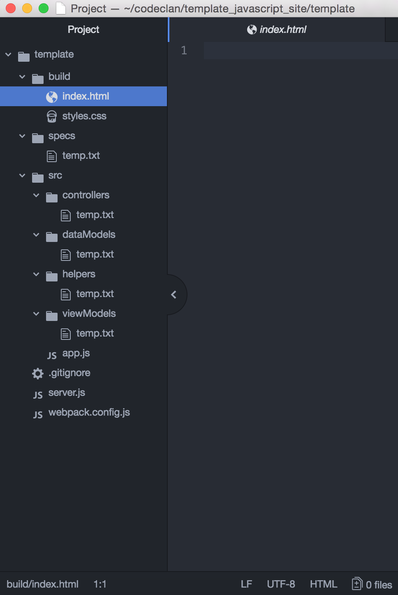

<a name="top"></a>
# A guide to a basic project setup

## Contents
  * [Create Basic File Structure](#file-structure)
  * [Git Setup](#git-setup)
  * [Install Modules, .gitignore, bundle.js](#install-modules)
  * [Recap of Part 1](#recap1)
  * [Post Structure Build - First Steps](#post-structure-steps)
    * [Basic Server.js](#server-js)
    * [Index.html](#index-html)
    * [Aside - Wireframe Contracts](#wireframe-aside)
    * [Basic App.js](#basic-app-js)
    * [Empty Route Controllers](#empty-routes)
    * [Recap of Part 2](#recap2)
    * [Final thoughts](#conclusion)

<a name='file-structure'></a>
## Create file structure

In below section any sub points are to signify files/folders created within the above folder.

At this point the goal is to only create **empty** folders and files. The structure of a project.

A 'feature' of GitHub is that it does not push empty folders.

If you wish the full file structure to be seen by everyone and not just the first creator then an empty placeholder text file could be created in each empty folder which may be removed after the first true file is entered.

* create project_folder
  * create a 'build' folder
    * create index.html file
    * create styles.css file
  * create an 'src' folder
    * create helpers folder
      * (create temp.txt file)
    * create viewModels folder
      * (create temp.txt file)
    * create dataModels folder
      * (create temp.txt file)
    * create controllers folder
      * (create temp.txt file)
    * create app.js file
  * create specs folder
    * (create temp.txt file)
  * create server.js file
  * create webpack.config.js file
  * create .gitignore file


Example below:




<a name='git-setup'></a>
## Git setup

This could also be done before creating the above file structure. In that instance at least one file must exist to be able to git commit -A and then git push. It won't work unless the folder contains something - for instance a README.md if desired.

* At top level of file structure
```sh
git init
```
* (still in master branch)
```sh
git add -A
git commit -m "first commit"
```

[Return to top](#top)

------------------

<a name="install-modules"></a>
## NPM setup + package.json scripts, .gitignore, & html

There are a few modules we need to bring in, and a few files we'll need to modify. Some will be dev-tool side only.

We should already have nodemon installed globally so no need to worry there. Some will also require us to edit the package.json file scripts a little.

* __npm__ (to be able to access the below modules)
* __express__ (for our server and controllers)
* __mocha__ (for our testing of our data models)
* __webpack__ (to allow for the bundling of our src code and keeping the live views up to date with our newly written code - or something)
  * __webpack__ may also require an additional install, will be detailed later
* __mongodb__ (to allow for an easier interface with our mongodb server and the database within)
* __body-parser__ (to allow us to convert request bodies from JSON to js automatically)


__Note__: any point where the following is written -

```sh
npm install <module>
```
that is the same as writing -
```sh
npm install --save <module>.
```


__But__, when saving as a __dev__ dependency then the full command must be used instead:

 ```sh
 npm install --save-dev <module>
```

-------------

* __Npm__

  * In the top level of our file structure (true for all the following modules as well)
```sh
  npm init -y
```
  * the -y auto-accepts all the defaults for npm, saving you having to enter multiple times just to accept them.
  * this command prepares npm for our project. We will need to setup our .gitignore on the modules, but we will leave that to the end.
  * If you are cloning from a repo that has already run through this and all the below modules, then remember you should only use the following command to get all your npm modules:

    ```sh
      npm install
    ```

* __Express__
```sh
  npm install express
```
  * this is a production dependency and so should be installed using using install or install --save as per your personal preference.
  * production dependency meaning that it will still be in use when our code is live to our users


* __Mocha__
```sh
npm install --save-dev mocha
```
  * this is a development dependency (a dev tool), meaning it should be installed using the --save-dev syntax
  * dev tool meaning that it is only used when a project is marked as being in development.
  * We haven't been shown how to switch from development (the default) to production yet, but I have seen what appears to be an option in webpack.


* __Webpack__
  * First, we should setup the webpack.config.js file that resides in the top level of our project structure.
  * If the structure detailed in the beginning has been followed, then the below code can be pasted into the webpack.config.js file:

  ```js
    config = {
      entry: __dirname + "/src/app.js",

      output: {
        filename: "bundle.js",
        path: __dirname + "/build"
      },

      devtool: 'source-map'
    }

    module.exports = config;
  ```
    * read following paragraphs to check what each part is doing or jump ahead to next bolded line:

    __Rundown of config file components:__
    * the entry is signifying the location of our main view - in our case our app.js file. Everything is then bundled up from that point, with webpack looks at everything app.js requires in, and then what those require in and so on.
    * the output is stating what it should call the file it creates after bundling all our code files up (we use bundle.js) with the path being where we should place that file (in our case in our build folder alongside our html)
      * as a follow on to above, in a future step we will need to script in our bundle.js file into our html file, in the head section. We'll reach that point later in this guide.
    * the devtool is asking what we should name the file it makes that is a slightly more readable to human eyes version of the bundle.js, this is stored in the same directory as the bundle.js (the build folder for us)
    * then we export it for use elsewhere (our html file for instance)

    __Back to Setup__
    * Now we have setup our webpack.config.js file, we should install webpack.

    ```sh
    npm install --save-dev webpack
    ```
    * There is another file to install, otherwise it will fail when you try to use npm run webpack (we'll get to that below). It does give you the command to use to install the cli dependency when it fails the run.
    * this appears to be some kind of additional dependency that is missed out of the main webpack. Feel free to wait on installing this until after we try to run webpack below, just incase the command or the situation has changed.
    * For reference, the command you will be asked to use should take the form (at least at this date: 28/02/2018):
    ```sh
    npm install webpack-cli -D
    ```
    * Again you may wish to wait on the above -cli install until you see it request it on trying to run webpack in the later segment on package.json.


* __Mongodb__
```zh
npm install mongodb
```
  * This gives us an interface for connecting to our mongo database more easily. It gives us access to an object with methods we can use to connect to and interact with our mongo server.

* __Body-parser__
```zh
npm install body-parser
```
  * This allows us to parse the body of http requests from JSON to js automatically.

* __package.json__
  * We now need to setup our package.json file correctly. It is located in whatever level of our project that we ran npm init in.
    * Which was hopefully the top level where your build, src, and specs folder where made as well are your server.js, .gitignore, and any other files or folders made by the npm modules.
  * In the scripts part of the package.json file we need to modify the "test" and "start" scripts, and add a new "webpack" script. Please keep in mind the commas if there are other scripts past the one you are writing.

  * __"test"__
    * This should redirect to your specs folder:

    ```json
    "test": "mocha ./specs",
    ```
  * __"start"__
    * This should use nodemon, rather than node. This means we can update our server side code, and not have to restart our server like we did with Sinatra.

    ```json
    "start": "nodemon server.js",
    ```
  * __"webpack"__
    * We need to create a webpack script that will bundle our code, and keep rebundling it so our html file can see the changes whenever we update our front end code.

    ```json
    "webpack": "webpack -w"
    ```
  * __Note__ on using scripts
    * test and start are default scripts and can be used just by typing:
    ```zh
     npm test
     npm start
    ```
     This can be done even if we change what they do (like using nodemon instead of node)
    * webpack is one we created ourselves (and it can be named anything, webpack is just clean for me), and to use it we must type (replace webpack with whatever name you like as long as it matches your script key):
    ```sh
    npm run webpack
    ```

  *  Finally, lets run the webpack so that it can create the bundles. We can shutdown the webpack straight after if you like, we only need to run it now to check we set it up correctly and that the bundle files have been made. After which we can ready our .gitignore and commit what we've done (details to follow).
  * type in the command for running webpack:

  ```sh
  npm run webpack
  ```
  * You should now see a bundle.js file and bundle.js.map file in our build folder.


* __.gitignore__
  * We should now setup our .gitignore file to ignore the features that people should be able to grab on their own through their npm init. This makes sure they any using our rep have up-to-date modules, and that our repo isn't filled with unneeded files and folder.
  * In same level as our .gitignore (or elsewhere with the correct relative filepath):

  ```zh
  echo "node_modules" >> .gitignore
  echo "/build/bundle.*" >> .gitignore
  ```
  * We are now ignoring the node_modules folder, and we are also ignoring any files named bundle.(whatever) that are located in the build folder. This means we are ignoring both bundle.js, and bundle.js.map.
  * We would also ignore anything like bundle.py, bundle.txt, bundle.html that happened to exist in the build folder.
  * That is unlikely to be the case, but keep it in mind, and write it the two files names out separately in the .gitignore if that becomes a concern.

* __Html__
  * To tie up the webpack business, we should script that bundle.js file into our index.html
    * Note that it is important that we call our main html file index.html. Ask Alex if you want more details on that! Think of it as a convention that in particular our express module expects if we use certain features of it.
  * In our (currently empty) index.html setup a basic html template by typing html and then letting atom (or whatever you use) autocomplete with tab or whatever button you have it set to. Then within the <head> element type the following:

  ```html
  <script src="bundle.js"></script>
  ```
  * because bundle.js is in the same folder as our index.html we don't need to write a more detailed filepath.

* Now feels like a good time to git again.
```zh
git add -A
git commit -m "installed npm modules, written .gitignore, and scripted bundle.js into index.html"
```
* If you've not already pushed to a GitHub repo now would also be a good time for that.

[Return to top](#top)

-----------------------
<a name='recap1'></a>
# Recap of Part 1

So far we have:
  * Built our basic file structure
    * potentially with temp.txt files in our currently empty folders so that they able to be pushed to GitHub
  * Setup a local git repo
  * installed basic npm modules
  * setup our npm scripts
  * setup our webpack config and create our bundle files by running it once
  * created a basic html template in our index.html file and linked our bundle.js to our html by using a script element
  * setup our .gitignore
  * hopefully now git commited a couple times and linked to a GitHub repo!
  * the above was all performed in the master branch to set it up for developement.
  * any future steps should occur on a feature branch, which has been branched from a develop branch, which was itself branched from master. Remember good git practise with regards to merging!

-------------

[Click to go to README_part2 as a separate file if preferred](https://github.com/dinhosang/template_javascript_site/blob/master/README_part2.md) or continue reading further down the page to find it here

--------------

<a name='post-structure-steps'></a>
## Post structure first steps for the project - i.e. good things to mob program

* Hopefully as a group you have built the above file structure together. While you are grouped up, it may also be useful to write a few common files together.
* With any of these it is of course up to your group whether you wish to mob program everything in your project, or whether you wish to while mostly pair or solo program, but maybe add a few more features to the mob program list than detailed below. Up to your team.
* Some of the below also relies on your team having discussed your mvp and perhaps having designed good wireframes detailing what contracts exist between the various parts of your site. Please feel free to check the link below for an example of what I mean if you're interested. You'll find an example wireframe contract of a particular page/view which details the elements, ids, what is part of the html file, and what is dynamic from js, and what the page implies for data and view models and what attributes and methods they should have to allow this page to exist (which is the end goal):


* Files to write up as a group:
  * a __basic server.js__ to listen to the correct port, to access our index.html, (and if you take the last option stated maybe you also wish to write the access to your controllers)
  * the __default html__ elements which are represented by your viewModels, within which will append more dynamic features to this defaut html element.
  * a __basic app.js__ file with just an event of the document loading, and an empty callback.
  * perhaps __controller files with empty paths__ for whatever routes you need for an mvp, just to solidify that everyone is on the same page about what your site is trying to achieve.

  * Don't forget good git practise of creating feature branches when working on the following.

[Return to top](#top)

---------------
<a name='server-js'></a>
* __server.js__
  * For a basic server.js we need to be able to access our server, and see our html and bundled code!
  * It's as good a place to start as any as without a connection to a server the site will never load when someone tries to access the url.
  * To do so we need to use features from the express module, and link our html page to it as well so that it knows what to display when people hit our homepage.

  * Starting from the top of our server.js file
  ```js
    const express = require('express')
    const server  = express()
  ```
  * The above code requires in whatever is contained within the express module.
  * When then assign the invocation of whatever was in that module to a variable named server, which we call by that name because that is what is is doing for us - acting as our server.
  ```js
    const express = require('express')
    const server  = express()
    //new lines
    const parser  = require('body-parser')

    server.use(parser.json())
  ```
  * The parser allows us to read from the body of a request without having to parse it first, it does that for us
  * We require it in and then .use its json method within our server.
  ```js
    const express = require('express')
    const server  = express()
    const parser  = require('body-parser')

    server.use(parser.json())
    // new
    server.use(express.static(`${__dirname}/build`))
    server.use(parser.urlencoded({extended: true}))
  ```
  * the new lines tells our server that there are files in our build folder that it needs to pay attention to.
  * As a default part of this feature, it knows to treat any file named index.html as our homepage, and automatically creates a GET route for the 'http://localhost:3000/' url (if that is the port we use), which is why we were were able to see the star wars quotes homepage without having explicitly written a .get('/', callback) route for the home route.
  * We will still need to write such an index for any other routes, such as for our apis (which are any routes which get information from our database).
  * The parser also comes with a method to handle url encoding (the characters used in urls sometimes like %20 which represents a space in a url). Not exactly sure what it does, just that we may need it! It is likely in classnotes from this earlier this week (week 13). We need to use this in our server just as we have the parser.json and the express.static(build path)

  ```js
    const express = require('express')
    const parser  = require('body-parser')
    const server  = express()

    server.use(parser.json())
    server.use(express.static(`${__dirname}/build`))
    server.use(parser.urlencoded({extended: true}))

    //new
    server.listen(3000, function() {
      console.log('Server listening on port 3000')
  })
  ```
  * For the new lines above you may change the port number to something other than 3000, but that's the default we have been using.
  * There is no need to have a callback or to log anything within it. It could be useful though to see that all is working as expected.

  * Now we have a working server, one that will refresh automatically when we change our server side code, thanks to nodemon (a module we installed globally in class).

[Return to top](#top)

  ------------
  <a name="index-html"></a>
  __index.html__
  * Now would be a good time to setup the basic structure of the site, by hardcoding the html elements that likely won't change very often if at all. This allows them to be targeted (and represented by) the viewModels.
  * If we take a look at the example wireframe posted above, and here again:


  

  * You may need to zoom in on your browser, or download the image and view in a separate program.
  * If we check it though, we can see that the wireframe on the left details what static elements we have (as well as their css contracts - their ids, which will aid with any future styling efforts by ensuring everyone knows from the beginning what ids were used).
  * From the diagram we can see that our group determined that the:
    * header (which we have id'ed as #banner) is a static element
    * ul (#bucket-list-view), is also a static element, which contains dynamic elements (it is one of our viewModels - given the class name ListView in our planning, part of its contract)
    * form (#add-country-form) is also static. It contains some static elements: a select with a starting option (likely reading something like 'please select a country name'), and a button. One of its child elements contains dynamic elements as well. As such the form is also a viewModel - named FormView as it will be populated using js.
      * the select dropdown (#country-dropdown) contains dynamic elements
      * the button (#submit-country-button) is static, but as an aside its purpose in this project would be achieved via js, not via the default html.
  * With that knowledge we can build our basic html structure. The styling of it will be left as a separate task in our css. Speaking of we should link that css file in our head element:
  ```html
    <link rel="stylesheet" href="styles.css">
  ```
  * If your group feels it is useful to break out the styling into separate files to handle different tasks, a styles folder could be made in the build and the css files moved into there, just be sure to include the relative path in the href for each one.
  * Your static elements will be determined by your project, so further examples will not be detailed here as this repo is to exist as a template for a potential site.

[Return to top](#top)

---------------
<a name='wireframe-aside'></a>
__Aside: Wireframe Contracts__
  * One last slightly lengthy aside for this section, you may have seen the right side of the diagram above shows a contracts list. These are contracts between the various parts of the project that have been determined naturally and declared and refined explicitly by the group during planing, and through the drawing of the wireframe.

  * _(if you wish you can skip to the_ [next section](#basic-app-js)_, though the following paragraphs detail something that I feel is quite useful! Of course you could skip whatever you want at any time anyway.)_

  * For instance, at the top of the actual wireframe diagram we can see the goal of this view which is to display a person's bucket list of countries to visit
  * Through this we know that we likely need a person model, and this model should hold a collection of countries. After discussion with the group it is decided that this should be on a this.bucketList attribute, which should return an array of country names - of strings.

  * We also know that this page holds a form for adding countries to our bucketList, so we know the person model should have a method to add to its this.bucketList array. In planning it was decided that it should be called addCountryToList('country name') which should accept a country name as a string and place it in the bucketList on that person instance.
  * Now the group could split and write a viewModel for the list of country names, a dataModel for Person (i.e. the Person class), and a controller route for handing the index call to the /person route which displays that persons bucketList (for basic mvp just have one person, but could modify to be a /person/:id route instead once ability to create and choose an account is added in as an extension maybe).

  * This is possible because everyone knows the expected inputs and outputs, and how those are achieved.
  * The colleague writing the ListView model knows that when that class is instantiated that it will be passed in as an argument a collection of countries which are just strings of country names (this is shown further down the wireframe diagram and detailed in the contracts)

  * The controller writer knows that if they create an instance of Person to interact with the person table in the database that there will exist at the very least the attribute .bucketList which will give the controller the array of country names it needs to pass to the viewModel, and on the CREATE route it knows that the instance of the Person class it has just invoked will have a method for adding that new country name to the database for that particular person.
  * And the individual writing the Person class knows that whatever else they write in their class (which the other parts of the project don't care about), they should have those two features, that return and accept the data types detailed in the wireframe contract, and should achieve the stated goals.

  * If your group handles the project via mob programming this ability to more safely modularise the building of the site amongst different colleagues will not be as important a feature, but it would probably still be useful to help guild the endeavour.

  * __Aside over__

[Return to top](#top)

---------------
<a name='basic-app-js'></a>
__basic app.js__

  * We have setup a basic server, and linked it to our build files, after which we setup our html file to show its static elements (with ids) and linked in our styles in addition to our earlier script in of our bundle.js
  * Let's set up our app.js which is responsible for controlling the view our users see when they hit our html page by going to our home route '/'.
  * Just a basic one. This can be built up as people finish designing view and data models, or used as a testing ground for checking things in the console browser. Or perhaps we fill in our app.js piece by piece only writing a viewModel as we come to it in our process of filling out our app.js. Whatever your group decides lets at least get a basic template going.
  * In app.js (hopefully located in your /src/ folder)
  ```js
    document.addEventListener('DOMContentLoaded', main)
  ```
  * Nothing can happen in terms of our dynamic javascript that faces our user, until we know the user has loaded the page. So first we set up an event listener on our page (the document) so that we're prepared to start the ball rolling once someone hits our site.
  * We've given the eventListener a callback named main, but currently this doesn't exist in our file. Now that we have named it, we need it. So let's write it.
  * Make sure you have webpack running if you wish to see anything logged out when you hit the homepage, as we are now modifying client side code so we need webpack to be continually bundling what we're writing.
  ```zh
    npm run webpack
  ```
  * Code to write to app.js
  ```js

    // new
    const main = function() {
      console.log('site loaded')
    }

    // already written
    document.addEventListener('DOMContentLoaded', main)
  ```
  * Now we have our app.js set up which will manage all the events we want to allow our users to perform. In the earlier wireframe diagram that meant being able to hit the homepage and see a list of countries in the bucket list, and being able to click a submit button to add a country.
  * Those functionalities could be performed by the viewModels in some fashion, perhaps being given a callback when they are constructed which is then able to send a request when the appropriate event occurs (like the button click)
  * Those request will hit the /api/whatever routes detailed in the controllers, the controllers would then interact with our data models which in turn could interact with our database and return the information the controller sought, which the controller then sends pack on the response to the appropriate source whether that be the viewModel or the app.js depending of your project structure.

[Return to top](#top)

---------------------
<a name="empty-routes"></a>
__empty controller routes__
* It should not be necessary if full wireframe contracts (or some other similar understanding) were made, but it could be useful to create the expected controllers for the MVP and empty paths for them just to make sure everyone is aware of what is going on, maybe with comments for what is expected to return in terms of status and body, and what is expected to be sent in the original request as well.
```js
  const express   = require('express')
  const parser    = require('body-parser')
  const whateverRouter = new express.Router()
  const Whatever  = require('../dataModels/whatever.js')

  // may not require the below parser.json line because the server combines this within itself in our server.js file, and the server uses this controller so perhaps all is well.
  // In which case we won't need the require('body-parser') in this file either, as it's handled in the server.js.
  // of course we need to make sure that we have our server.js use this controller and assign it the appropriate path
  whateverRouter.use(parser.json());

  // INDEX route - (R)
  whateverRouter.get('/', function(req, res) {
    // create instance of whatever

    // use the method detailed in contract to get require information

    // maybe have a check to see if the data model reports an error connecting to the database

    // manipulate data as needed

    // add data to body of res, log to console and send res if needed (not required if using res.json(data) as that sends it automatically)
  })
  // ...

  module.exports = whateverRouter;
```
  * If following the above idea of detailing out empty routes that you know the project will need for mvp (which may not be all of them), then be sure to add this controller to the server in server.js (as mentioned in the comments regarding the parser.json)
  * In server.js
  ```js
    // already written
    const express = require('express')
    const parser  = require('body-parser')
    const server  = express()

    server.use(parser.json());
    server.use(express.static(`${__dirname}/build`))
    server.use(parser.urlencoded({extended: true}));
    // new
    server.use('api/whatever', require(`${__dirname}/src/controllers/whateverApiController.js`))

    // already written
    server.listen(3000, function() {
      console.log('Server listening on port 3000');
    })
  ```
  * The new lines makes our server aware of our controller (which has only empty paths currently but is still a controller)
  * If we have many controllers we could choose to create a central controller in the controllers folder that is then used by the server, to aid in readability and maintainability of the server.js file.

[Return to top](#top)

-----------
<a name='recap2'></a>
__RECAP Part 2__

We have now:
  * built a basic server.js file that can listen to a port and receive visits to the home route
  * built a basic html template with our static elements that our viewModels will hook onto to and represent
  * built a basic app.js file that is now ready to await user events and invoke our viewModels
  * maybe - some controller files with empty routes, but with comments about purpose and response, which have been linked to the server in our server.js file.

[Return to top](#top)

-------------------
<a name="conclusion"></a>
## What's Next?

That's up to the group, hopefully planning and design have been performed, and there is an idea of how you all will be working towards the MVP.

As part of the planning the group has hopefully also considered what contracts need to exist between the various parts of your project so that if you work alone or in pairs that the parts you build have the correct hooks and expect the correct data so that they can integrate more comfortably together. Even if working through mob programming, it would be good to have a clear view about what each part is expecting, and expected to do, before starting to program.

The inner workings don't need to be figured out, just the expected input and output, that is the basic requirement for ensuring you can fit your pieces together.

Don't forget good git practise!

Of course everything detailed here is just one opinion. It's one I've started to form form conversation with and listening to fellow students and our instructors, but an opinion is all it is. I simply hope this is of some use to people, even if just as a stepping stone to something more fully fleshed out.

If it does lead that way please let the rest of us know your findings too!

Oh, and there is one folder we haven't discussed at all, which is the helper folder. Use this if you find yourself using similar functionality across different classes or files. You could refactor the code to instead of repeating yourself in each file, simply make a helper class which will do the heavy lifting for you in each of those files. It's more a folder for future optimisations than a tool to use in active development. At least for the time frame we're on.

We also didn't touch on testing, but that's because we built no models as part of this basic setup. Don't forget to test them with mocha too! The green ticks are too much fun to ignore.

[Return to top](#top)
